# AlienBody

<p align="center">
  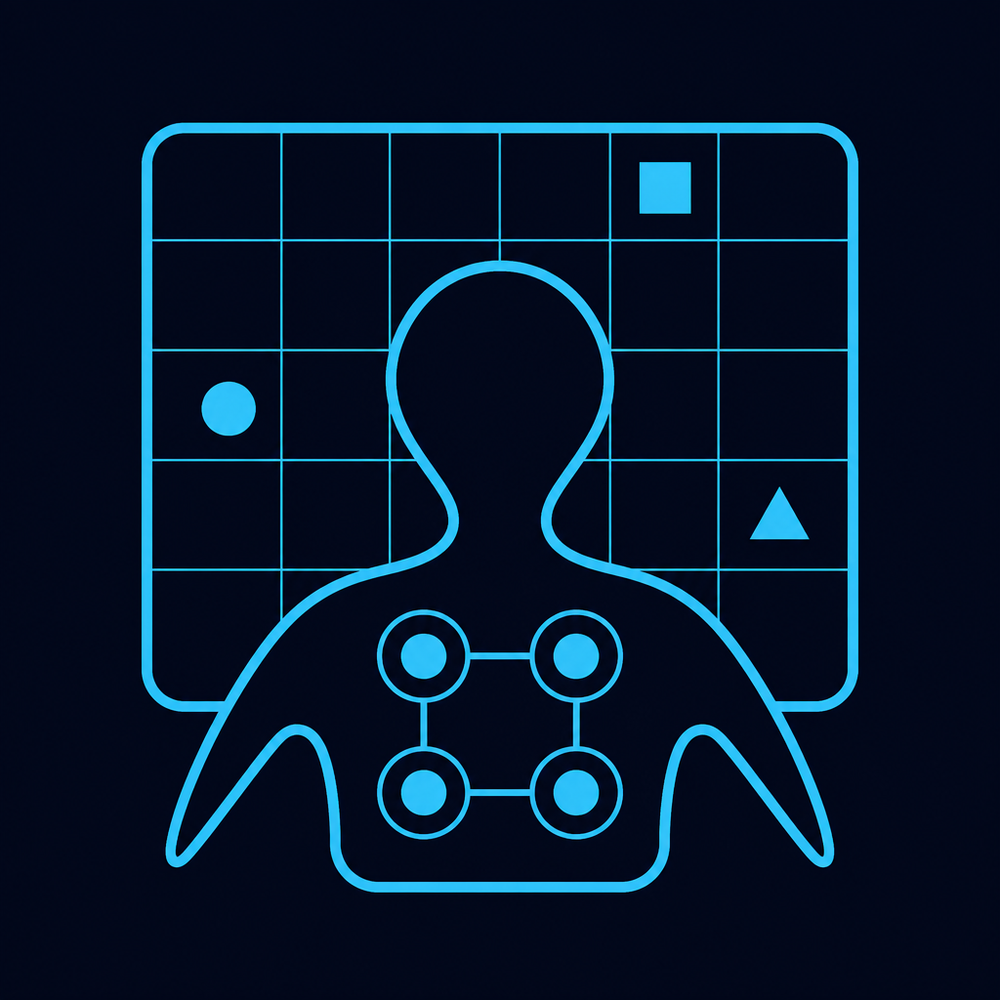
</p>

<h1 align="center">AlienBody</h1>

<p align="center">
  <b>Diagnosing How LLM Agents Acquire and Use Action Models</b><br/>
  <sub>Anonymous code &amp; benchmark release · under peer review</sub>
</p>

<p align="center">
  Separate acquisition from use — anonymous actions, then controlled interventions.
</p>

<p align="center">
  <a href="https://anonymouspubcode.github.io/ICLR27-AlienBody/"></a>
</p>
<p align="center">
  <b><a href="https://anonymouspubcode.github.io/ICLR27-AlienBody/">→ Project website: clips, game stills, quick start</a></b>
</p>

<p align="center">
  <a href="#quick-start"></a>
  <a href="LICENSE"></a>
  <a href="web/"></a>
  <a href="assets/media/"></a>
  
</p>

<p align="center">
  
  &nbsp;
  &nbsp;
  &nbsp;
  &nbsp;
  &nbsp;
</p>

> A named camera-ready repository will replace this anonymous mirror upon acceptance.

<p align="center">
  <a href="https://anonymouspubcode.github.io/ICLR27-AlienBody/">
    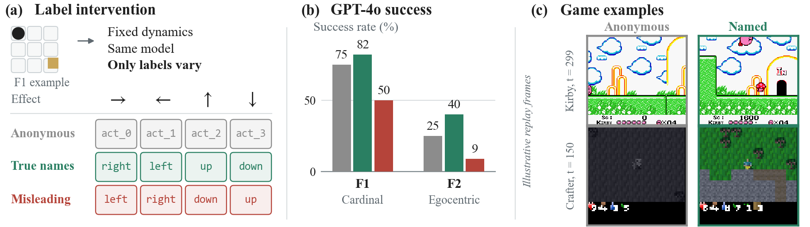
  </a>
</p>
<p align="center"><sub>Figure&nbsp;1 — Same environment, same model: only button labels change, and success tracks the labels. <a href="https://anonymouspubcode.github.io/ICLR27-AlienBody/">Open the project website</a> for animated clips.</sub></p>

---

## At a glance

| | |
|---|---|
| **Problem** | Agent scores conflate familiar action names, interaction evidence, and planning. AlienBody separates how models *acquire* vs *use* action models. |
| **Protocol** | Phase&nbsp;1: probe anonymous IDs (`action_0`…). Phase&nbsp;2: navigate to a hidden-then-revealed target with the induced mapping. |
| **Name prior** | On Spatial (F2), GPT-4o: named-true **40%** · anonymous **25%** · named-misleading **9%** (same 50 envs). |
| **External games** | Kirby &amp; Crafter: naming shifts measured success under matched visual protocols (see clips below). |
| **Using knowledge** | With effect names supplied, in-context agents stay near 0–10% on Relational; programmable interfaces raise success by tens of points vs conversational oracles. |
| **Release** | Env code · 720 Tier-M envs (train/dev/test; secret withheld) · local web demo · evaluation scripts · media |

## Explore

| Link | What you get |
|------|-------------|
| [**Project page**](https://anonymouspubcode.github.io/ICLR27-AlienBody/) | Clips, game stills, quick start (GitHub Pages) |
| [`web/`](web/) | Interactive FastAPI demo (human play + algorithmic agents) |
| [`assets/media/`](assets/media/) | GIF / MP4 clips: AlienBody families + Kirby / Crafter stills |
| [`assets/figures/`](assets/figures/) | Paper figures (teaser, name prior, wall ladder, game evidence) |
| [`DEPLOY.md`](DEPLOY.md) · [`DEPLOY_DEMO.md`](DEPLOY_DEMO.md) | Host the demo (Render / HF Space) |
| [`data/envs/`](data/envs/) | Frozen train / dev / test JSON |

---

## Watch: algorithms vs. random (same env)

Side-by-side **Oracle · Systematic · Random** on one frozen environment per cognitive family.
Header = phase; caption = agent / family / step / outcome.

| F1 Adapt | F2 Spatial | F4 Relational |
|:---:|:---:|:---:|
| 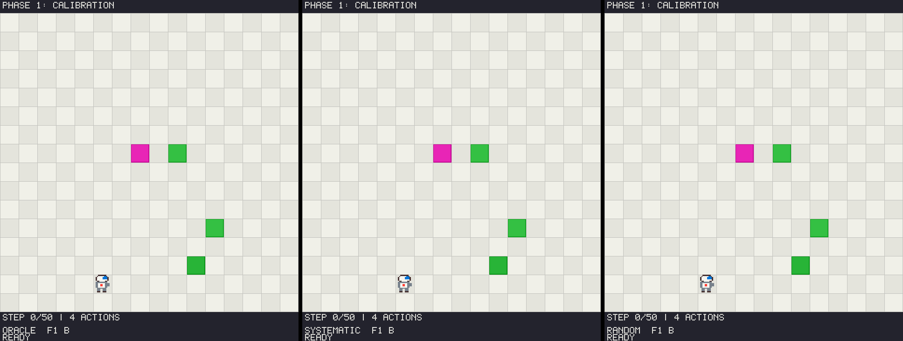 | 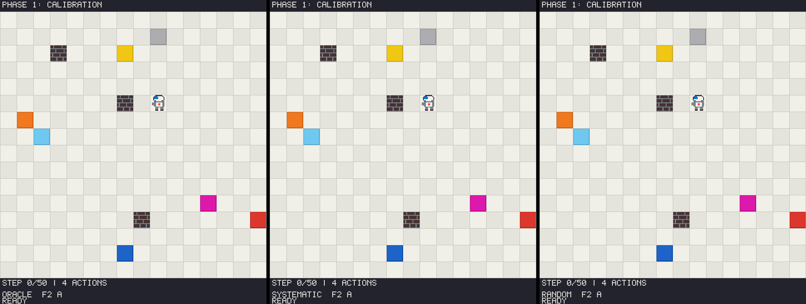 | 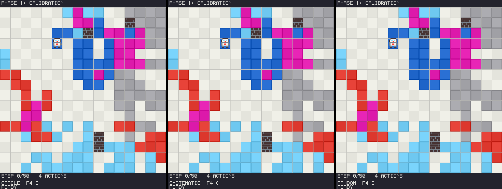 |

| F3 Conditional | F5 Compositional | F6 Temporal |
|:---:|:---:|:---:|
| 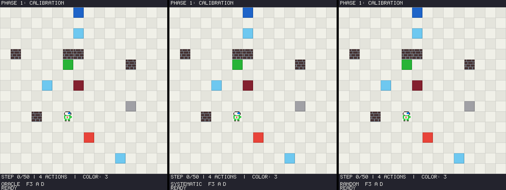 | 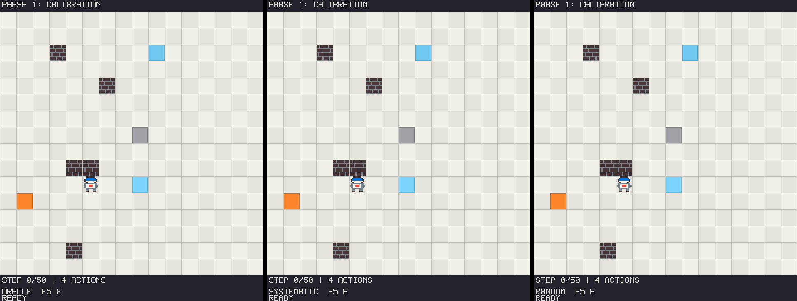 | 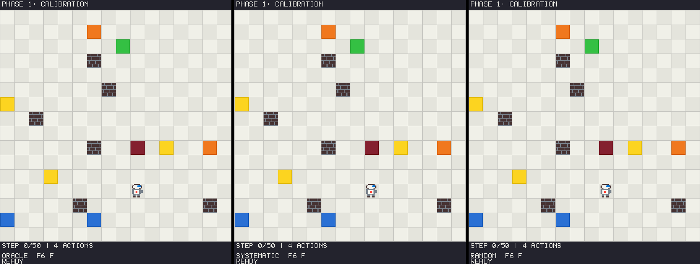 |

More clips (including open-VLM replays): [`assets/media/alienbody/`](assets/media/alienbody/).

### Open-VLM replays (Qwen3.5-4B, re-rendered from eval logs)

| Success on F1 | Characteristic F4 struggle |
|:---:|:---:|
| 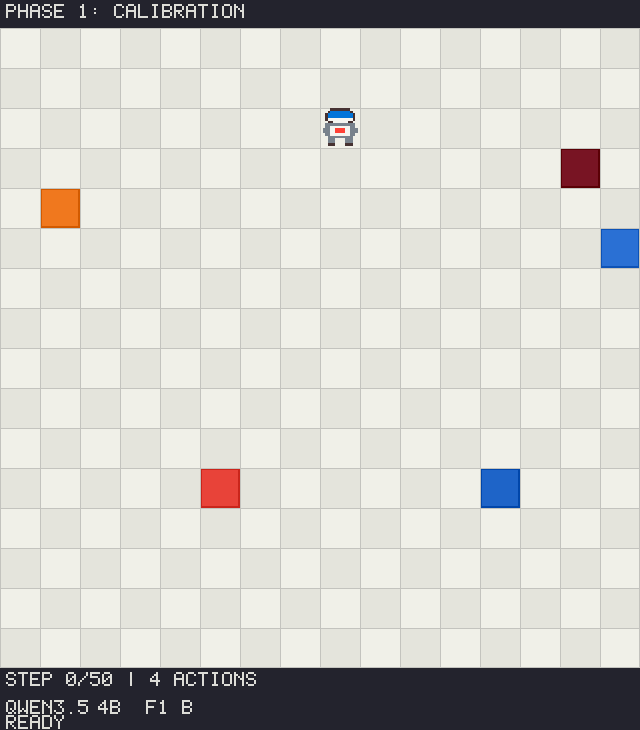 | 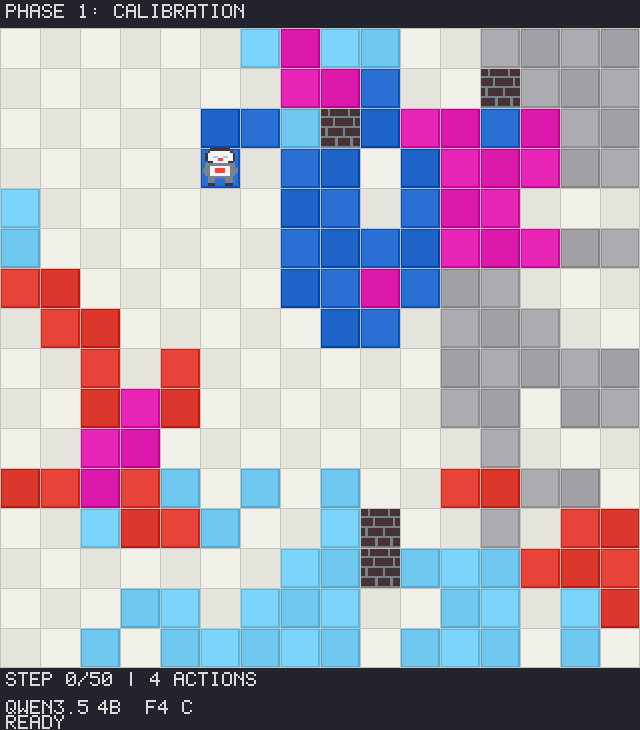 |

---

## Watch: name prior on real games

Same visual protocol; only how actions are *named* changes.

| Kirby named (step 299) | Kirby anonymous (step 299) |
|:---:|:---:|
| 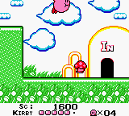 | 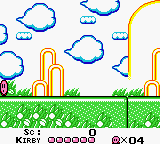 |
| Deep into the level | Still at spawn |

| Crafter named (step 150) | Crafter anonymous (step 150) |
|:---:|:---:|
| 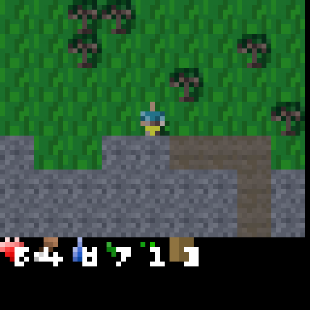 | 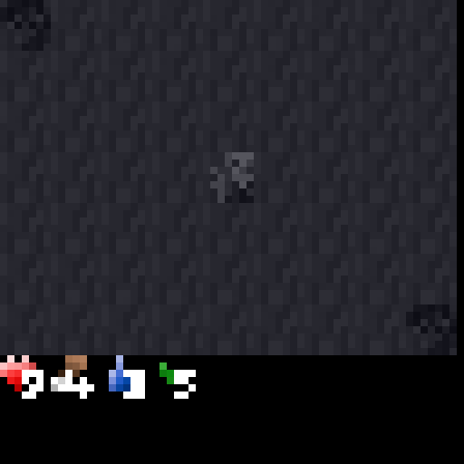 |
| Camp / achievements | Near spawn, ~0 achievements |

<p align="center">
  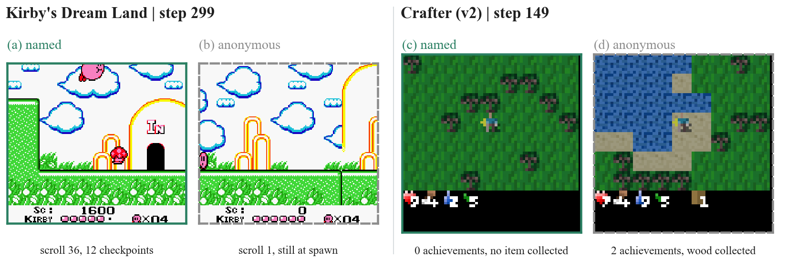
</p>

---

## Why AlienBody?

Most agent benchmarks leak action semantics through button names. AlienBody exposes only anonymous IDs and asks agents to **calibrate then plan**.

| Layer | Question | Status in our results |
|-------|----------|------------------------|
| Explore | Can you systematically test buttons? | Scripts solve it |
| Interpret | Can you induce an executable model? | Partially open |
| Plan | Can you search over that model in-context? | Hard wall for end-to-end VLMs |

<p align="center">
  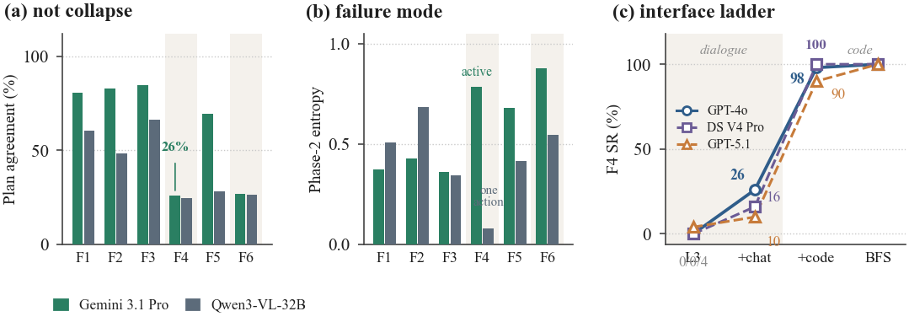
</p>
<p align="center"><sub>Interface ladder: conversational oracle access helps little; writing a searcher over the oracle nearly closes the gap.</sub></p>

---

## What's included

```
AlienBody/
├── alienbody/           # env + agents (oracle, enum, AFMB, VLM clients)
│   ├── nextstep/        # J-protocol arms: adapters, interfaces, records, blocks
│   └── workflow/        # AlienWorkflow flagship task (bit-state schema)
├── data/envs/           # Tier-M train/dev/test (720; secret withheld)
├── data/envs_m8/        # Relational n=8 stress set (50)
├── data/frozen_suites/  # nextstep F4 / workflow formal sets (400 envs each)
├── data/fmb_trajectories/  # F4-only training data for the induction-frontier rows
├── protocols/nextstep/  # J-protocol specs + prereg env ids (see its README)
├── tests/               # offline stub regressions (no network, no GPU)
├── scripts/             # generate / run_eval / demos / reproduce / verify
├── web/                 # interactive FastAPI demo (+ sprite assets)
├── assets/
│   ├── figures/         # paper figures (PNG)
│   ├── media/           # GIF/MP4 clips + game stills
│   └── icons/           # vendor marks (CC0 Simple Icons)
├── index.html           # GitHub Pages landing (anonymouspubcode.github.io/…)
├── website/             # style.css + redirect helper
└── DEPLOY*.md           # hosting notes
```

Check what you have before running anything:

```bash
python scripts/verify_release_bundle.py   # imports, data digests, hygiene, stub regressions
```

## Quick start

```bash
pip install -r requirements.txt

# No API key needed
python scripts/run_eval.py --agent oracle --family 1 --split test --n-envs 3
python scripts/run_eval.py --agent afmb --family 4 --split test --n-envs 5

# Interactive demo
python web/app.py   # → http://localhost:8000  (or PORT=18181)
```

Regenerate environments:

```bash
python scripts/generate_envs.py
```

## LLM / VLM evaluation

Set keys in the environment (see `.env.example`):

```bash
python scripts/run_eval.py --agent gpt-4o --family 1 --split test --n-envs 5 --modality image
```

Vendor marks in `assets/icons/` are from [Simple Icons](https://simpleicons.org/) (CC0); see [`assets/ATTRIBUTION.md`](assets/ATTRIBUTION.md).

## Reproduce the induction frontier (training rows)

The paper's induction-frontier table has a row per trained variant, all but one
flat at the same floor. To let you re-run those rows instead of trusting them:

```bash
pip install -r requirements.txt -r requirements-train.txt
bash scripts/reproduce_induction_frontier.sh          # 5 default rows: train + eval
bash scripts/reproduce_induction_frontier.sh train    # train only
bash scripts/reproduce_induction_frontier.sh eval     # eval only (after training)
```

The script prints a preflight and stops before training if anything is
missing. What you must supply yourself:

* **Base weights** — Qwen3.5-9B and Qwen3.5-4B in HF layout; point `BASE9` /
  `BASE4` at them. Nothing here downloads them.
* **One CUDA device** — selected via `CUDA_VISIBLE_DEVICES`; the script sets no
  device. LoRA runs fit a single card; the full-FT row is heavier.
* **What is not one command**: the J-protocol launcher
  (`run_nextstep.py`, which reads the run configs of our cluster runs) and the
  trained checkpoints are not part of this release; the script trains the
  checkpoints, and the launcher's assertions are kept as skipped tests in
  `tests/`.

Two rows are **archival records, not evidence** (their defects are documented
in the paper's appendix and in the script headers): the multi-observation row's
evaluation loop never called the model, and the full-FT row trained on an input
that contained the ground-truth schema and was evaluated against base weights.
They are off by default; `ARCHIVE_ROWS=1` runs them as records only.

Re-runs are expected to be *statistically* equivalent, not bit-identical: the
original runs were not hash-pinned, so record the commit you used alongside any
number you quote.

## Deploy

Local demo is enough for review. For a public playground, see **[`DEPLOY_DEMO.md`](DEPLOY_DEMO.md)** (Render recommended; HF Spaces needs PRO for Docker).

## License

MIT. Benchmark instances released for research under the same terms.

## Citation

Anonymous while under review. A `CITATION.cff` stub is included; BibTeX will appear in the camera-ready version.
